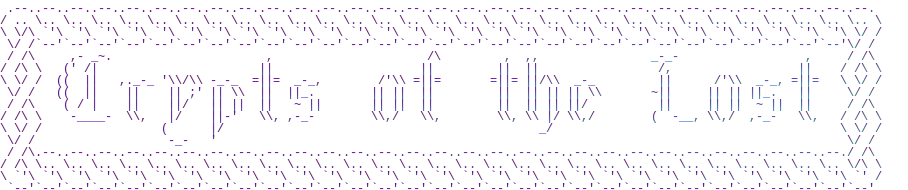

# Introduction

An MMO Dungeon Crawler Roguelite inspired by [Hypixel Skyblock](https://hypixel.net/categories/skyblock.194/)

# Quirks

Crypts of the Lost is a bit of a quirky game, here are some of the weird and wonderful things about it:

- Crypts of the Lost is server software only, there is no official client for the game, you may write your own using
  bindings, either official or community made; or you can use one another person in the community made!
- Automation and bot creation is permitted and encouraged, we want you to automate the game using code and try to push
  it to its boundaries.
- It's also free, and open source!
